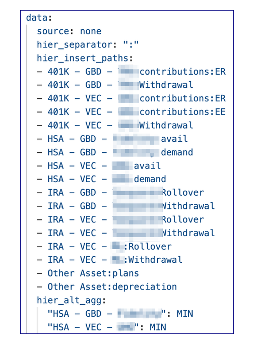
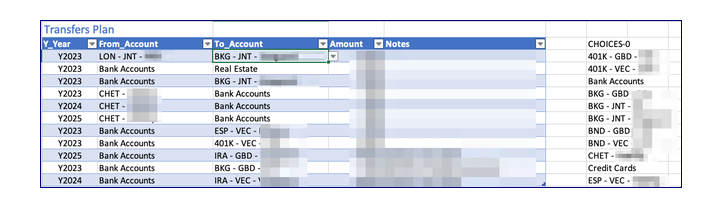
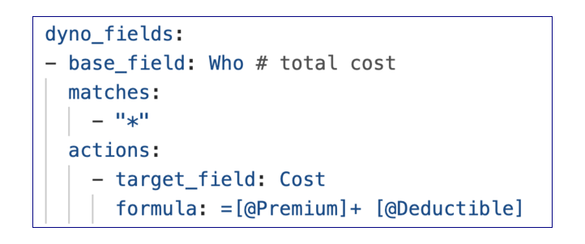

# The configuration file

The control file is `./data/config.yaml`.  To reference the schema insert the following line at the top:

  ```
  # yaml-language-server: $schema=../dance/book/config_schema.json
  ```

  Or, in Visual Code, set a reference in `settings.json`:

  ```
      "yaml.schemas": {
        "./dance/book/config_schema.json":"config.yaml"
        },
  ```

## Global Settings

The following values are global in nature:

|Item|Purpose|Example|
|:--|:---|---|
|bank_interest|Moneydance category used to convey bank interest to the account balances| Income:I:Invest income:Int:Bank|
|end_year |Last Year of the time series| 2030
|first_forecast_year |First year that is considered a forecast. Prior years are considered actual| 2022
|hide_years|List the years to hide on all sheets as numbers| 2018
|lambdas|Excel lambda functions are defined here|[See Lambdas](#lambdas)|
|start_year |Integer of 1st year to use for time series| 2018
|theme|Set the formatting theme from files in `themes/`|Berlin|
|workbook|The name of the workbook including path from project folder. Used as the default for most programs.|data/test_wb.xlsx|
|year_column_width|Column size for years| 12
|zoom_scale|Scaling factor for all sheets| 135 # how to scale the worksheets

### Lambdas

Defined as a list of dictionaries, each of which contains a name, a comment, and the formula.  For example:

```yaml
lambdas:
  - name: AGE
    formula: =LAMBDA(inits,yr,ROUNDDOWN(((DATE(yr,12,31)-DOB(inits))/365.25),0))
    comment: Return the age attained by an account owner with inits in a given year
```

### Themes

The themes are stored in the `dance/themes/` folder and are copied based on their name. The schema lists a few that are copied from Excel. 

## Sheet groups

Sheets are grouped together in sheet groups using the `sheet_group` definitions.  Each sheet is assigned to a group and thus shares the color and table style.

```yaml
sheet_groups:
  acct-bal:
    color: 4FA3DB
    table_style: TableStyleMedium2
  income-expense:
    color: BDAE2D
    table_style: TableStyleMedium12
  ...
```

## Sheets

This section defines the layout and sometimes the data to be loaded into the sheet. It is a list of definition of each sheet.  So at that level it looks like:

```yaml
sheets:
  accounts:
  balances:
  iande:
  ...
```

## Table Definitions

Within each sheet are the list of tables. Most sheets only have one.  Here's an example with two:

```yaml
retireparms:
  sheet_group: retirement
  tables:
  - name: tbl_retire_parms
  - name: tbl_pens_facts
```
By convention all the table names start with `tbl_`.

The table definition consists of various fields, some of which are optional and/or defaulted.

|Item|Purpose|Default|
|:--|:---|---|
|**name**|The name for the table in Excel, by convention starting with tbl_|
|**title**|The title that is place above the table in Excel||
|**columns**|A list of the column definitions (see [below](#column-definitions)) that are included in the table|
|title_row|When there is more than one table, locates this table on the sheet. If tables are spread horizontally, then subsequent tables will need an entry.|1 for the first table, then automatically places a space before the next table.
|start_col|The first column of the table on the sheet (A=1,B=2...)|1|
|include_years|True if there is a time series for the years|False|
|hidden|A list of columns to hide|Show every column
|data|definitions where to get the data for the initial load|Don't load data|
|[actl_formulas](#actual-and-forecast-formulas) |Specify formulas for actuals.|
|[fcst_formulas](#actual-and-forecast-formulas)|Specify formulas for forecast periods.|
|highlights|Specify Excel conditional formatting|
|[dyno_fields](#build-time-created-fields)|a way to determine values at build time|
|[edit_checks](#edit-checks)|Sets data validation in Excel for table columns|
|preserve|Indicates what from a table to be "preserved" and how (only method "sparse" implemented). non-year-cols lists any columns other than forecast years to be preserved.|
|fold_at |For tables that fold, an integer indicating the level at which to leave the fold closed.|3|

### Column definitions

The following support column definitions

|Item|Purpose|Default|
|:--|:---|---|
|name|the column heading|
|width|optional width used to set column width in spreadsheet|width of previous column|
|horiz|optional indicator of horizontal alignment such as "center"
|number_format|number from [openpyxl chart](https://openpyxl.readthedocs.io/en/stable/_modules/openpyxl/styles/numbers.html) |


### Data definitions

The data definitions are purpose built to support the target table, but there are some elements that are common.  Some data definitions are closely related, so, to prevent duplication, the yaml reference/override notation is used (& and *).  

|Item|Purpose|Use context|
|:--|:---|---|
|source|local to reference local files; remote to pull data over internet. remote to pull data over internet. internal is used to create the table/sheet cross reference.|
|type|These codes are used by the program select the processing logic to use. [See supported types](#supported-types)|local|
|path|path relative to project folder|for local sources, the path and name of the primary input file|
|file_sets|for items that require additional files, one or more sets of files are defined. Each file set has a name and a value of the base_path which is a folder name with the trailing slash. Valid names are "balances" and "performance"|
|group|Specific Moneydance groupings to include. Moneydance uses these to categorize accounts.  Its things like: Assets, Bank Accounts, Credit Cards...  |Accounts, Balances|
|no_details_for|For these groupings create rows only at the grouping level, no details. Investments here means to summarize to the investment level and don't carry over the securities.|Accounts|
|include_zeros|Accounts listed here will be carried over even if the balance is zero|Accounts|
|tax_free_keys|Mark the accounts that are not subject to current income tax|Accounts|
|site_code|BLS, or FEDREG. Used to determine which site to reference|remote|
|api_key|If needed. A reference to the api_key which is stored in ./private/api_keys.yml|remote|
|table|Defines how to locate a table in HTML|remote|
|table.find_method|caption - only supported method|remote|
|table.method_parameters|parameters for the method, specifically the text to search for in the caption.|remote|
|hier_separator|Typically set to colon.  The existence of this key indicates that the lines should be subtotaled and folded|iande,current,aux|
|[hier_insert_paths](#inserting-rows) |Some line items are do not yet exist or are not yet populated in Moneydance. This is a way to insert them within the hierarchy so they can be used for forecasting.|iande,current,aux|
|hier_alt_agg|This optional field allows aggregation to occur by any of the following methods: MIN, MAX, PRODUCT. The default is TOTAL. This is a mapping between lines and one of the aggregation types.|
|template|Used in the cases where a template is used to generate the table. For the extract operation, this specifies the fields which are to be pulled from the table.  In the case of folding, it specifies the field to fold on and the indent depth|

#### Supported Types

The types `json_index, json_records, *_template` are supported by the extract utility, so the values can be edited in Excel and saved off to be used in the next build. For the templates, additional definition is provided in the `config.yaml` config file.

The types `md_*` act on exported Moneydance files.

|Type|Purpose|
|:--|:---|
|json_index| Imports entire table. Suitable when the table has a unique key.|
|json_records| Imports entire table. Suitable when the table does not have a unique key.|
|md_529_distr|Get the 529 plan distribution records from Moneydance export and summarize so data items can be put in spreadsheet|
|md_acct|Processes the latest balances report from Moneydance to set up the accounts table|
|md_bal|Processes the balances reports from Moneydance to set up the balances table|
|md_hsa_disb|Get the HSA disbursement records from Moneydance export and summarize so data items can be put in spreadsheet|
|md_iande_actl|Processes the income and expense report from Moneydance to create the iande and current sheets|
|md_invest_actl|Sets up the investment actual transfers|
|md_invest_iande_work|Read investment income and expense actual data from file into a dataframe|
|md_ira_distr|Get the IRA distribution records from Moneydance export and summarize so data items can be put in spreadsheet|
|md_pr_sav|Get the payroll to savings records from Moneydance export and summarize so data items can be put in spreadsheet|
|md_roth|Get the roth contributions|
|md_sel_inv|Get amounts transferred to/from certain brokerages, mutual funds, loans from/to any banks.|
|md_transfers_actl|Sets up the non-investment actual transfers|
|retire_medical_template|Sets up the retire medical table based on a template|
|retire_template|Set up the retirement table based on a template|
|tax_template|Prepares the taxes worksheet based on a template|


#### Inserting Rows

An optional key is used to define new rows to be inserted on sheets that use the folding/subtotaling method.

For instance, the income and expense report in MoneyDance filters out categories that have no transactions.  This leads to a need to insert those rows in the `tbl_iande` and `tbl_iande_actl` tables. For example, future social security payouts should subtotal into retirement income. 

It is also useful in the aux table to construct subtotals.

The specification of the new rows needs to contain the full hiearchy information so that it can be inserted into the right place.  At run time these are checked against the existing items and added only if not already there.

Note: include only those lines that are not headings or totals. Headings and total lines will be constructed and inserted as well as the specified data lines.

In this example, we aggregate based on the MIN function to plan the distributions from the health savings accounts



### Actual and Forecast Formulas

There are three optional keys to allow formulas to be established for the years section: `actl_formulas`, `all_col_formulas`, and `fcst_formulas`.  They work the same way but apply to different columns, as their names indicate.

Each section consists of a list of rules.  All rules have the following parts:

|Key word|Description|
|---|---|
|formula|The formula to use for the selected year columns (actual or forecast)
|first_item|Optional. In some cases the first item or items of the series needs to be different. If supplied it may be a keyword `skip`. If it starts with `=` then it is a formula that will be used in the first place. Otherwise, it will be a constant or a list of constants separated by `,`. In that case it will be applied to the first *n* positions.|

There are two constructions.  The first is the enumeration method, where the config lists all the keys that are to be matched against a base field.

|Key word|Description|
|---|---|
|base_field|The name of the column that is used for matching|
|matches|A list of values by which to match rows. This could match a single row or many rows.|

The second construction allows for queries against several fields.  These are "anded" together to product a boolean series to select the rows to be updated.

|Key word|Description|
|---|---|
|query|The query is a list of objects with the following fields.|
|- field|A field name in this table|
|- compare_to|A value to compare to, either a string or a number|
|- compare_with|A comparison like "=", starts, not_starting, not_ending is_in. YAML requires the equals to be quoted. The codes not_ending and is_in require a list a list|
|- look_up|Allows for the values to be looked up from another table. It requires three addtional subfields: table, index_on and value_field.


For example, if there is a key `fcst_formulas` under the table, it is used to set formulas for the forecast columns.  Each column receives the same formula, but they can vary by row.  

For example:

```yaml
  - query: #  Mkt Gn Rate
    - field: ValType
      compare_with: "="
      compare_to: Mkt Gn Rate
    - field: Type
      compare_with: "="
      compare_to: I
      look_up: 
        table: tbl_accounts
        index_on: AcctName
        value_field: Type
    first_item: =XLOOKUP([@AcctName],tbl_accounts[Account],tbl_accounts[Near Mkt Rate],0)*[@Active]
    formula: =XLOOKUP([@AcctName]&":Unrlz Gn/Ls",tbl_invest_iande_ratios[Key],tbl_invest_iande_ratios[Y1234])
 ...
```

How to use the look_up function

```yaml
          - query: # Bank actual interest
            - field: ValType 
              compare_with: "="
              compare_to: "Rlz Int/Gn"
            - field: Type
              compare_with: "="
              compare_to: B 
              look_up: 
                table: tbl_accounts
                index_on: AcctName
                value_field: Type
```

Using the `is_in` comparator:

```
          - query: # Add/Wdraw - Assets, Liabilities & Loans
            - field: ValType
              compare_with: "="
              compare_to: Add/Wdraw          
            - field: Type
              compare_with: is_in
              compare_to:
              - A
              - L
              - N
              look_up: 
                table: tbl_accounts
                index_on: AcctName
                value_field: Type
```

The `not_ending` method actually splits the text based on ' - ' and takes the last item for comparison.  This is used to detect the folded subtotal rows.  This is used to set all rows to "=0" (except the summaries) to prevent preserve_changes from copying every zero

            ```
            - query: 
                - field: Key
                  compare_to:
                  - CT_TAX
                  - FED_TAX
                  - MAX
                  - MIN
                  - PRODUCT
                  - TOTAL
                  compare_with: "not_ending"
              formula: =0

            ```

#### Array formulas

It is not possible to use dynamic arrays fully as they are not well supported (yet?) by `openpyxl`. However, some effort has been made to allow for control-shift-enter (CSE) arrays. These work best when the formula summarizes to a single cell or results in a single column of results in a fixed size array.  This has been tested for use with data validation.

For instance the following formula selects the active accounts with no distribution plan which is used for data validation of a table field.

```
=SORT(FILTER(tbl_accounts[Account],(tbl_accounts[Active]=1)*(tbl_accounts[No Distr Plan]=1)))
```

The result is stored under a heading of CHOICES.  The data validation is a list with a source of `=$F$3#`.  The # indicates the entire result set.



The following formula (shown wrapped) uses dynamic array functions, but due to the `openpyxl` limitation it results in a CSE formula, which is fine since it produces a single value.

```
=SUM(
  BYROW(
    (tbl_transfers_plan[[From_Account]:[To_Account]]=tbl_balances[@AcctName])*HSTACK(-tbl_transfers_plan[Amount],tbl_transfers_plan[Amount]),
    LAMBDA(_xlpm.row,SUM(_xlpm.row))
  )
  *(tbl_transfers_plan[Y_Year]=this_col_name()))
```

The lambda function needs its parameters prefixed with _xlpm.  The code handles the prefixes for the dynamic array functions.

After an Excel session when the file is saved, Excel will rewrite the document so that the internal XML files have new schemas listed.  Further, if a CSE formula is edited, it may be converted to a dynamic array formula, and, in that case, an internal `metadata.xml` file is created to support the dynamic arrays.  If `openpyxl` later rewrites the file, the `metadata.xml` and the references to it in the dynamic array formulas will be lost.  This has the effect of converting back to a CSE formula.

### Build-time created fields

Some tables need a way to determine values at build time. The `dyno_fields` section may be directly under the table.



the `matches` list is a list of values to be matched agains the field. There is a special case if just a single *, meaning all.

The target field should be previously defined, but it is filled in by this logic.  The commands available are:
- suffix - something added to the matched item
- constant - a value that is always the same
- formula - an Excel formula

#### Formula Specifics

- Always start the formula with a leading equals sign.
- Constants are fine, but remember to use the leading equals sign
- Structured table references are supported and recommended.  
- Refer to this column with the VBA function `this_col_name()`
- Many VBA functions are designed to be used in formulas

### Highlights

For example the following puts a line between the actual and forecast periods. The anchor, (ampersand) allows other tables to use the same by using `*past_future`. 

```yaml
    highlights: 
      present: &past_future
        formula: =A$2="Y" & 1+ YEAR(NOW()) # A$2 ref is to heading row.  1 + is workaround to using the ref to table.
        border:
          edges: 
          - left
          style: thin
          color: B50000
```

This should work but doesn't:

=A$2=VLOOKUP("first_forecast",INDIRECT("tbl_gen_state"),2)# A$2 ref is to heading row. INDIRECT is Excel work around.

### Edit Checks

This provides a way to use a dynamic array filter in Excel to create a data validation list (a drop down menu) for a set of columns.

```yaml
      edit_checks:
        - for_columns:
            - From_Account
            - To_Account
          formula: =SORT(FILTER(tbl_accounts[Account],(tbl_accounts[Active]=1)*(tbl_accounts[No Distr Plan]=1)))          
```
The formula will be placed to the right of the table and the a data validation will reference it for each of the columns.  In this example the active accounts with no distribution plan will be displayed as the drop down choices for the to listed columns.


## Specific Sheets & Tables

### Inflation

You may want to consider a different series.  The default is all items in U.S. city average, all urban consumers, not seasonally adjusted.

### Required minimum distributions

At the time of writing the best source seems to be the Federal Register.  This does not need to edited unless the source changes.  

### Accounts

The data section in the `config.yaml` needs the following sub-sections:

|Item|Description|
|:--|:--|
|path|Path from the project root where to find the saved report`.  This should be one with all the accounts you wish to use.|
|group|this is a list of the summary levels you wish to use in your plan.  The items can either be the categories that Moneydance uses such as Bank Accounts, or it can be summary accounts that you have created (accounts that have sub-accounts)|
|no_details_for|If you have summary accounts that cover all the items in a category, then you can use those instead of the leaf accounts. By listing the category hear the detail accounts will be ignored.
|include_zeros|Usually zero balance accounts will be ignored.  If the account is entered here, it will be carried forward.  This can be useful if its a brand new account with no balance or if its an old account that had a balance in the historical period.
|tax_free_keys|A list of keywords that will be used to determine how the tax status of the account will be initialized.|
|force_active|A list of accounts to force active. By default accounts with zero balance are made inactive|

Example:

```yaml
path: ./data/2022 Account Balances.tsv
group:
- Bank Accounts
- Credit Cards
- Real Estate
- Other Asset
- Liabilities
- Mortgage Loans
- Non Mort Loans
no_details_for:
- Assets
- Loans
include_zeros:
- My old HSA
- My old 401K
tax_free_keys:
- 401K
- "529"
- IRA
```
