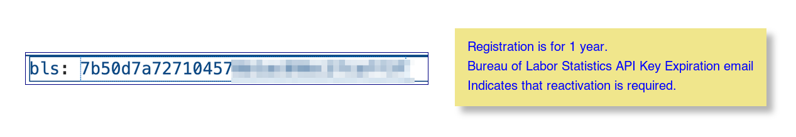

# API key

The system copies the inflation data to faciliatate planning.  To do this an API key is needed.  This is free; they only want an email address.  Register here: <https://data.bls.gov/registrationEngine/>.  The API key should be stored in ./private/api_keys.yml. The rows of this file are expected to be simply a site code and the key value, such as below:

