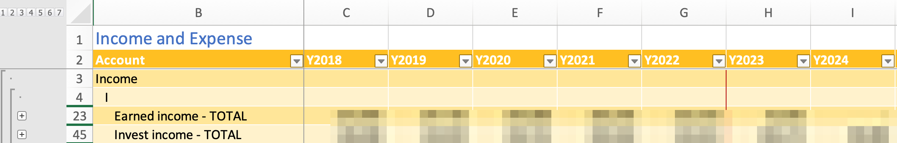

# Design of fcast.xlsm

## Tables

The spreadsheet is based entirely on a set of Excel tables.

Many of the tables represent time series where the time is based on years.  The data elements are typically financial values associated with a year.  For instance, the balances table tracks how balances change year by year.

The time sequence columns are labeled with 'Y' + year.    The meaning of the column data depends on the state of the system.  To the left of the first forecast year, data is considered actual, while to the right it is forecast.  In the following example, the red line marks the transition from actual to forecast.

Other columns are labeled with appropriate short column labels.

 An index of tables is maintained on the 'utility' worksheet, which allows the worksheet to be located by the VBA function.  This itself is a table and it is created by a Python program `index-tables.py`.

## Worksheets

Tables are distributed over a set of worksheets. Sometimes a worksheet holds more than one table.

[Worksheets](./worksheets.md)

## Excel Calculations

Use of Visual Basic (macros) allows for calculations to be done in a more readable manner.  However there is a downside.  This is that Excel cannot use its dependency trees to know what needs to occur when the macros reference or update a value with this method.  So far, I have not turned on the use of the application volitile method, as there is significant overhead, possibly causing slow performance. There is a macro, currently called calc_retir(), to perform the re-calcuations in the correct order. 

## Functions

There are Visual Basic for Applications functions in this worksheet.  These are listed in the [VBA index](./vba_index.md).  The [full source](./vba_sorted.md) is also imported here as part of the build process.

One commonly used function is `get_val`. The get_val routine requires the use of worksheet tables, and references the values by the row names and the column names.

### Calculations

There are some complex dependencies between sheets.  Generally the flow is between sheets for a year, then certain values are carried forward into the next year.

Currently, in some cases it is necessary to run `calc_retir` in order to complete the calculations. 

## Conventions

### Excel conventions

- All table names begin with `tbl_`.
- Except where visible, such as column names and row labels, use lowercase except for acronyms.
- Use underscores between words.
- Use std abbreviations as follows:

    |	long	|	short	|
    |---|---|
    |	actual	|	actl	|
    |	annuity	|	anny	|
    |	balances	|	bals	|
    |	duration	|	dur	|
    |	investments	|	invest	|
    |	parameters	|	parms	|
    |	pension	|	pens	|
    |	retirement	|	retir	|
    |	value or valuation 	|	val	|

### Moneydance conventions

- Actual account names are generally of the form *type-who-firm* where type is one of 401K, 529, BKG, BND, ESP, HSA, IRA, IRA Roth, LON, MUT.
