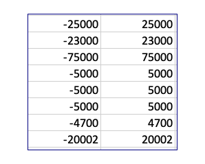

# Some Excel idioms & notes

## This column

Use the indirect method to locate this column.

```title="Refer to this column"
INDIRECT("tbl_balances["&this_col_name()&"]")
```

or a native way to locate this column name is (this only works when selecting data from this table or a table with the same set of columns)

```
=INDEX(tbl_balances[#Headers],COLUMN())
```

Note, that the table name can be elided to reference the table the cell is in.  Excel displays the table name in the formula even if is not provided.

```
INDEX([#Headers],COLUMN())
```

To locate the column of a different table

```
XMATCH(this_col_name(),tbl_retir_vals[#Headers])
```

So getting the column can be done with indirect, but that will slow things down since INDIRECT is a "volitile" function, which triggers recalculation at every change. 

```
INDIRECT("tbl_balances["&INDEX([#Headers],COLUMN())&"]")
```

Other ways is using a non-structured approach. These phrases require the [#Data] bit when entered via openpyxl, even though it disappears in Excel when edited. Otherwise you get a name error.

`=INDEX(tbl_aux[#Data],0,COLUMN())`

`=CHOOSECOLS(tbl_balances[#Data],COLUMN())`

The following picks a year column from balances by locating the year in the headers and using that to choose the column.

`=CHOOSECOLS(tbl_balances[#Data],XMATCH(this_col_name(),tbl_balances[#Headers]))`

```title="Prior year end balance"
=XLOOKUP("End Bal"&tbl_retir_vals[@Item],tbl_balances[Key],
  CHOOSECOLS(tbl_balances[#Data],XMATCH(this_col_name(),tbl_balances[#Headers])-1)
  )
```

These depend on the whole table, though, where the INDIRECT method depends only on the column.

## The last column

```
CHOOSECOLS(tbl_manual_actl,-1)
```

## The last column field name

Useful to get the last actual, for instance.

```
=TAKE(tbl_manual_actl[#Headers],1,-1)
```

## Value in prior column for this row

```title="Use OFFSET"
=OFFSET(INDIRECT(ADDRESS(ROW(),COLUMN())),0,-1,1,1)
```

But... OFFSET is a volatile function, causing performance problems.


## Lookup

Use a value from this table to find a value in another table. The 4th parameter is the default if not found.

```title="Locate a value with a common key"
XLOOKUP([@AcctName],tbl_retir_vals[Item],INDIRECT("tbl_retir_vals["&this_col_name()&"]"),0)
```
Here get the value for a year from the retirement table based on the account name.

## Construct a key

Often the exact key has to be constructed.  Excel uses double quotes for strings and `&` for concatenation.  TRIM is needed if the field is, say, indented.

```title="Use string functions to construct key"
"Add/Wdraw"&TRIM([@Account])
```

## Delimited strings to arrays

Often the field value may have delimiters and you need to pick out one of the sections.  User the TEXTSPLIT and INDEX functions. For instance to pick out the 2nd item of the field `key`. Note the delimiter can be longer than a single character.

```title="Picking values between delimiters"
INDEX(TEXTSPLIT([@key]," - "),2)
```

## Substring match

Is a substring in a list?  Use SEARCH wrapped with ISNUMBER.

```title="Find values with substring"
ISNUMBER(SEARCH("Start BalHSA - "&INDEX(TEXTSPLIT([@key]," - "),2),tbl_balances[Key]))
```

## Is value in a list

For use in filters, determine if a value is in a list. Construct the list with curly brackets.  Use the type 0 for exact match.

```title="Find values that match a list"
ISNUMBER(MATCH(tbl_balances[ValType],{"Start Bal","Add/Wdraw","Reinv Amt","Fees","Unrlz Gn/Ls"},0)
```

## Filter then aggregate

Filters produce more than one row so the results have to be aggregated by SUM, PRODUCT, MIN or the like.

Criteria are all required with multiplied together with *. To allow either criterion, use +.

In this example several rows are selected to compute the end balance.

```title="Filter with criteria 'anded'"
SUM(FILTER(INDIRECT("tbl_balances["&this_col_name()&"]"),(tbl_balances[AcctName]=tbl_balances[@AcctName])*ISNUMBER(MATCH(tbl_balances[ValType],{"Start Bal","Add/Wdraw","Reinv Amt","Fees","Unrlz Gn/Ls"},0))))
```

In another example, two items are multiplied:
```title="Pick two rows and multiply them"
PRODUCT(FILTER(INDIRECT("tbl_balances["&this_col_name()&"]"),(tbl_balances[AcctName]=tbl_balances[@AcctName])*((tbl_balances[ValType]="Reinv Rate")+(tbl_balances[ValType]="Rlz Int/Gn"))))
```

### If filter can be empty

If the result can be empty then use the if_empty parameter

```title="Last parm of FILTER is 0 to allow empty set"
=-SUM(FILTER(INDIRECT("tbl_retir_vals["&this_col_name()&"]"),(tbl_retir_vals[Item]=TRIM([@Account]))*(tbl_retir_vals[Election]="ROLLOVER"),0))
```

## Convert transaction format to net change

The `transfers_plan` table is in a transactional format, with a year, two accounts (from and to) and a value.  This ensures that both sides of the transaction are accounted for.  However, most other tables have a net change style - what happens to a particular account in a year. This formula converts the plan to the net change format.

Working in memory, two arrays element by element, then add them up.

### Construct debit/credit array for account

#### Make boolean array

This creates an array of two columns and as many rows as in the table.

```title="Structured table reference to mark this account"
(tbl_transfers_plan[[From_Account]:[To_Account]]=tbl_balances[@AcctName])
```

#### Construct two values array column array

This creates two columns with the same number of rows with a negative and positive version of each amount

```title="Horizontal stacking"
HSTACK(-tbl_transfers_plan[Amount],tbl_transfers_plan[Amount])
```

#### Multiply them

||||||
|---|:---:|---|:---:|---|
||X||=||


### Add across rows

The BYROW and LAMBDA functions are used. Each row is passed into lambda as the parameter `row`, which is then summed. the `_xlpm.` is needed as Excel uses that to identify the parameter name.  It is actually stored in the internal XML but not displayed in the Excel user interface.

```title="Sum by row"
BYROW((tbl_transfers_plan[[From_Account]:[To_Account]]=tbl_balances[@AcctName])*HSTACK(-tbl_transfers_plan[Amount],tbl_transfers_plan[Amount]),LAMBDA(_xlpm.row,SUM(_xlpm.row)))
```

The result is then multiplied by the year selection to get all net of all the transactions for the account and year, as shown here:


### Final sum

Wrap the whole thing in a `SUM()` to get the net change in the account for the year.

```title="Full"
SUM(BYROW((tbl_transfers_plan[[From_Account]:[To_Account]]=tbl_balances[@AcctName])*HSTACK(-tbl_transfers_plan[Amount],tbl_transfers_plan[Amount]),LAMBDA(_xlpm.row,SUM(_xlpm.row)))*(tbl_transfers_plan[Y_Year]=this_col_name()))
```

## Forecasting based on last n elements

Linear least squares fit. The example takes current cell with `INDIRECT(ADDRESS(ROW(),COLUMN())` as the basis for `OFFSET` which looks back 5 columns on this row and includes this row and 5 samples in the form of a 1 by 5 matrix. This needs to be a just a 1D series, so `TOROW` is used.  Then we just ask the linear forecast tool to provide item 6 for a sequence of 5 elements.  Seems like it should require the sequence to be 1D as well, but it doesn't.


```title="Forecast"
=FORECAST.LINEAR(6,TOROW(OFFSET(INDIRECT(ADDRESS(ROW(),COLUMN())),0,-5,1,5)),SEQUENCE(1,5))
```

## LET example: Simple return calculation

The following computes a simplistic return by setting intermediate variables with LET. 

| Variable | Description |
| ----------- | ----------- |
|y|The column of data for this year
|a|The account name
|b|The value types of the rows to be averaged for the denominator
|c|The value types of the rows to be summed for the numerator
|x|The indicies to locate the denominator values
|w|The indicies to locate the numerator values

after all these are set is fairly easy to use CHOOSEROWS to select the right data elements.  The 2 is for the average. Wrapping with IFERROR forces the #DIV  to 0.

```  
  =LET(
    y,INDIRECT("tbl_balances["&@INDEX(tbl_balances[#Headers],COLUMN())&"]"),
    a,[@AcctName],
    b,{"Start Bal","End Bal"},
    c,{"Rlz Int/Gn","Unrlz Gn/Ls"},
    x,MATCH(@b&a,[Key],0),
    w,MATCH(@c&a,[Key],0),
    IFERROR(2*SUM(CHOOSEROWS(y,w))/SUM(CHOOSEROWS(y,x)),0)
    )
  ```


## Tax calculations 

Not implemented but kind of cool

```title="Federal tax calc for a year and a taxable income value"
=ROUND(SUM(BYCOL(FILTER(tbl_fed_tax,(tbl_fed_tax[Year]=2022)*(tbl_fed_tax[Range]<260361)),LAMBDA(column,MAX(column)))*{0,0,260361,-1}),0)
```

## Conditional Formatting limits

Conditional formatting formulas cannot use structured references, including bare table names.

## Looking for non-native formulas

```bash
 grep formula: data/setup.yaml | grep -v 'XLOOKUP\|LET\|FILTER\|FORECAST\|OFFSET\|BYROW\|INDIRECT'
```

## Using LAMBDAs in defined names

It is not clear if Excel properly handles a lambda inside a let inside a lambda.  

Even though I put the _xlpm. in properly, and it is in the workbook.xml file as input, the prefixes are dropped insided the nested elements, unless they are defined in the outer element.

The problem is that each of the parameters needs a hidden defined name too.  Excel creates these upon open. 

It appears that Excel converts input "lambda" into "LAMBDA", then subsequent processing is based on the upper case version.
So when Openpyxl provides these functions, they need to be provided in uppercase.

This fixed my simplified formula. the nested case has not been retested.

### Current list

- DOB <br>
  Get date of birth for initials
- THIS_YEAR
  Suitable to use in tables in columns that represent years. Returns the year as a number.
- AGE
  Return the age attained by an account owner with inits in a given year
- ROW_IN
  Return a one row array containing data from the current row in the array. Call like this 
- ROW_IN(tbl_iande[#All])
- PRIOR_COLS
  Get column references for the prior n columns suitable for CHOOSECOLS for a table or array
- PRIORS
  Get column values for the prior n columns for a table or array

### Get Prior cells on this row

``` Straight line forecast but no less than zero
MAX(0,FORECAST.LINEAR(6,TOROW(PRIORS(ROW_IN(tbl_iande[]),5)),SEQUENCE(1,5)))
```
Note that `tbl_iande[]` is short for `tbl_iande[#All]`.