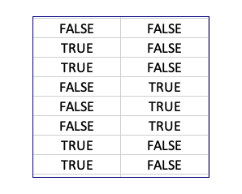
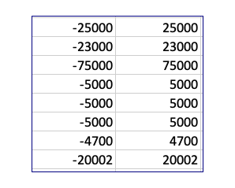
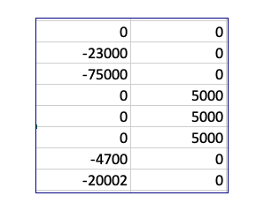
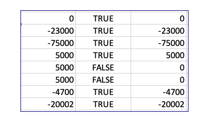

# Some Excel idioms & notes

## This column

### Getting the column name

The lambda function THIS_COL_HDR is used internal to a table to identify the column name.  Call with tbl_xxx[#Headers]

Alternatively, native way to locate this column name is (this only works when the table starts in Excel column 1)

```
=INDEX(tbl_balances[#Headers],COLUMN())
```

Note, that the table name can be elided to reference the table the cell is in.  Excel displays the just table name in the formula even if it is not provided. But its best to provide the full expression the `setup.yaml`.

```
INDEX([#Headers],COLUMN())
```

To locate the column of a different table, the offset can be determined with `XMATCH`:

```
XMATCH(THIS_COL_HDR[#tbl_balances[#Headers]],tbl_retir_vals[#Headers])
```

### Use of the structured [#Data] notation

Using this formulation creates a dependency on the whole table, which is fine for looking up values that themselves don't depend on other tables. But it is not appropriate for year-to-year calculations, as it will create circular logic.

#### Getting data column with Index or Choosecols

These phrases require the [#Data] phrase when entered via openpyxl, even though it disappears in Excel when edited. Otherwise you get a name error.

`=INDEX(tbl_aux[#Data],0,COLUMN())`

`=CHOOSECOLS(tbl_balances[#Data],COLUMN())`

The following picks a year column from balances by locating the year in the headers and using that to choose the column.

`=CHOOSECOLS(tbl_balances[#Data],XMATCH(this_col_name(),tbl_balances[#Headers]))`

```title="Prior year end balance"
=XLOOKUP("End Bal"&tbl_retir_vals[@Item],tbl_balances[Key],
  CHOOSECOLS(tbl_balances[#Data],XMATCH(this_col_name(),tbl_balances[#Headers])-1)
  )
```

## The last column name and data

### The last data column

Takes the last data column. Useful for actual only tables that you want to propagate the last values from.

```
CHOOSECOLS(tbl_manual_actl[#Data],-1)
```

### The last column field name

Useful to get the last actual, for instance.

```
=TAKE(tbl_manual_actl[#Headers],1,-1)
```

## Lookup

Use a value from this table to find a value in another table. The 4th parameter is the default if not found.
=XLOOKUP("Medicare withholding rate",tbl_manual_actl[Item],CHOOSECOLS(tbl_manual_actl[#Data],-1))


```title="Locate a value with a common key"
=XLOOKUP("Medicare withholding rate",tbl_manual_actl[Item],CHOOSECOLS(tbl_manual_actl[#Data],-1))
```
Here get the value for forecast rate using the lastest actual rate.

### Constructing a key

Often the exact key has to be constructed.  Excel uses double quotes for strings and `&` for concatenation.  TRIM is needed if the field is, say, indented.

```title="Use string functions to construct key"
"Add/Wdraw"&TRIM([@Account])
```

## Delimited strings to arrays

Often the field value may have delimiters and you need to pick out one of the sections.  Use the TEXTSPLIT and INDEX functions. For instance to pick out the 2nd item of the field `key`. Note the delimiter can be longer than a single character.

```title="Picking values between delimiters"
INDEX(TEXTSPLIT([@key]," - "),2)
```

## Substring match

Is a substring in a list?  Use SEARCH wrapped with ISNUMBER.

```title="Find values with substring"
ISNUMBER(SEARCH("Start BalHSA - "&INDEX(TEXTSPLIT([@key]," - "),2),tbl_balances[Key]))
```

## Is value in a list

For use in filters, determine if a value is in a list. Construct the list with curly brackets.  Use the type 0 for exact match.

```title="Find values that match a list"
ISNUMBER(MATCH(tbl_balances[ValType],{"Start Bal","Add/Wdraw","Reinv Amt","Fees","Unrlz Gn/Ls"},0)
```

## Filter then aggregate

Filters produce more than one row so the results have to be aggregated by SUM, PRODUCT, MIN or the like.

Criteria that are all required are multiplied together with *. To allow either criterion, use +.

In this example several rows are selected to compute the end balance. THE Y1234 is replaced at build time for each year column.

```title="Filter with criteria 'anded'"
=SUM(FILTER(tbl_invest_actl[Y1234],(tbl_invest_actl[ValType]="Gains")*(tbl_invest_actl[Acct_txbl]=1)))
```

### If filter can be empty

If the result can be empty then use the if_empty parameter

```title="Last parm of FILTER is 0 to allow empty set"
=ROUND(SUM(FILTER(tbl_invest_iande_values[Y1234],(tbl_invest_iande_values[Account]=[@AcctName])*(tbl_invest_iande_values[IorE]="I"),0)),0)
```

## Convert transaction format to net change

The `transfers_plan` table is in a transactional format, with a year, two accounts (from and to) and a value.  This ensures that both sides of the transaction are accounted for.  However, most other tables have a net change style - what happens to a particular account in a year. This formula converts the plan to the net change format.

Working in memory, two arrays element by element, then add them up.

### Construct debit/credit array for account

#### Make boolean array

This creates an array of two columns and as many rows as in the table.

```title="Structured table reference to mark this account"
(tbl_transfers_plan[[From_Account]:[To_Account]]=tbl_balances[@AcctName])
```

#### Construct two values array column array

This creates two columns with the same number of rows with a negative and positive version of each amount

```title="Horizontal stacking"
HSTACK(-tbl_transfers_plan[Amount],tbl_transfers_plan[Amount])
```

#### Multiply them

||||||
|---|:---:|---|:---:|---|
||X||=||


### Add across rows

The BYROW and LAMBDA functions are used. Each row is passed into lambda as the parameter `row`, which is then summed.

```title="Sum by row"
=BYROW((tbl_transfers_plan[[From_Account]:[To_Account]]=tbl_balances[@AcctName])*HSTACK(-tbl_transfers_plan[Amount],tbl_transfers_plan[Amount]),LAMBDA(row,SUM(row)))*(tbl_transfers_plan[Y_Year]=INDEX([#Headers],COLUMN()))
```

The result is then multiplied by the year selection to get all net of all the transactions for the account and year, as shown here:



### Final sum

Wrap the whole thing in a `SUM()` to get the net change in the account for the year.

```title="Full"
SUM(BYROW((tbl_transfers_plan[[From_Account]:[To_Account]]=tbl_balances[@AcctName])*HSTACK(-tbl_transfers_plan[Amount],tbl_transfers_plan[Amount]),LAMBDA(_xlpm.row,SUM(_xlpm.row)))*(tbl_transfers_plan[Y_Year]=this_col_name()))
```

## Forecasting based on last n elements

Linear least squares fit. The example looks back 5 columns on this row for the `y` values and uses numbers 1 to 5 as the `x` values.  Then we just ask the linear forecast tool to provide item 6.  Wrap the whole thing with a MAX to prevent it from going negative.

```title="Forecast"
=MAX(0,FORECAST.LINEAR(6,tbl_iande[@5<Y1234],SEQUENCE(1,5)))
```

### Get Prior cells on this row

The above uses [build time replacement](./workbook.md#build-time-column-substitutions). 

`tbl[@5<Y1234]` becomes `tbl[[#This Row],[Y2018]:[Y2022]]`, when in the Y2023 column.

So the form `[@m<Ynnnn]` says for the m years in this row preceding this year.

## LET example: Simple return calculation

The following computes a simplistic return by setting intermediate variables with LET. 

| Variable | Description |
| ----------- | ----------- |
|y|The column of data for this year
|a|The account name
|b|The value types of the rows to be averaged for the denominator
|c|The value types of the rows to be summed for the numerator
|x|The indicies to locate the denominator values
|w|The indicies to locate the numerator values

after all these are set is fairly easy to use CHOOSEROWS to select the right data elements.  The 2 is for the average. Wrapping with IFERROR forces the #DIV  to 0.

```  
  =LET(
    y,INDIRECT("tbl_balances["&@INDEX(tbl_balances[#Headers],COLUMN())&"]"),
    a,[@AcctName],
    b,{"Start Bal","End Bal"},
    c,{"Rlz Int/Gn","Unrlz Gn/Ls"},
    x,MATCH(@b&a,[Key],0),
    w,MATCH(@c&a,[Key],0),
    IFERROR(2*SUM(CHOOSEROWS(y,w))/SUM(CHOOSEROWS(y,x)),0)
    )
```


## Tax calculations 

There is a set of lambda functions that work together to assist in tax calculations. These culuminate in TX_CT and TX_FED which are inserted on the proper lines due to folding. The file `taxes_template.tsv` contains lines that call for this type of aggregation:

- Initial Tax Calculation - CT_TAX
- Fed tax - FED_TAX

Other states could be patterned off the TX_CT method.

## Conditional Formatting limits

Conditional formatting formulas cannot use structured references, including bare table names.

## Looking for non-native formulas

```bash
 grep formula: data/setup.yaml | grep -v 'XLOOKUP\|LET\|FILTER\|FORECAST\|OFFSET\|BYROW\|INDIRECT'
```

