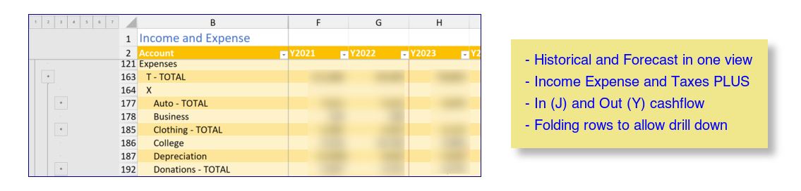

# Tool links accounting data with long term plans

This system extends the family's historical financials into the future.  It allows for modeling and planning for 

- Income and expenses (combined with cash flow)
- Accounts balances and transfers (including investments)
- Working life and retirement phases
- Post retirement medical plans (U.S.)
- U.S. Federal and state income taxes. The tax calculator is far from general.

The accounting system is Moneydance.  The long term planning is via Microsoft 365 Excel. [Python is the glue](./python.md).

## Data

The data for historical (actual) periods is based on data exported from Moneydance. Data for planning is controlled via a set of external files. The data files are described on the [Data Files page](./data_files.md).

## Workbook

The workbook is built from the above data by Python programs controlled by an extensive configuration file.

[Workbook](workbook.md)

## Getting Started

[Getting Started](./setup_summary.md)

## Operations

[Operations](operations.md)

## Use cases

Some worked examples are on the [use cases page](./use_cases.md).

