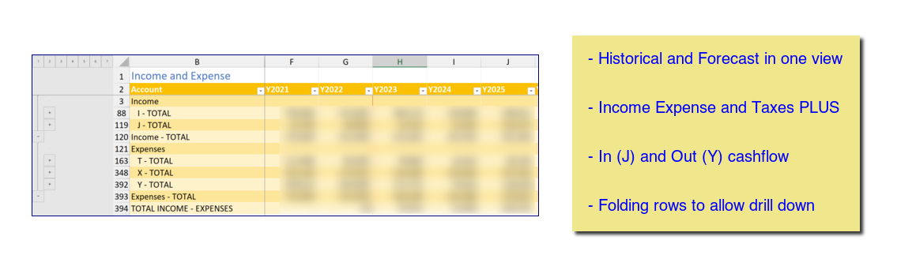

# Tools to integrate accounting data with long term plans

The accounting system is Moneydance.  The long term planning is via Microsoft 365 Excel.

This workbook extends the family's historical financials into the future.  It allows for modeling and planning for 

- Income and expenses (combined with cash flow)
- Accounts balances and transfers (including investments)
- Working life and retirement phases
- Post retirement medical plans (U.S.)
- U.S. Federal and state income taxes. The tax calculator is far from general.

## Data

- The data for historical (actual) periods is based on data exported from Moneydance.
- Data for planning is controlled via a set of external files.

The workbook is built from the above by Python programs controlled by an extensive configuration file.

[Workbook](workbook.md)

[Operations](operations.md)

[Python is the glue](./python.md)

[Visual Basic](vba_index.md)

[Getting Started](setup.md)
