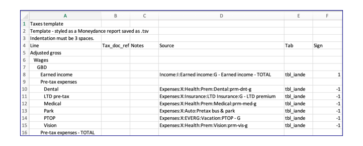

# taxes

This computes Federal and State income taxes, using the folding method.

In my configuration it uses the Excel maximum of 8 levels.

The functional fields brought in from the template are:

- Line - The line name on this sheet (indented style)
- Source - The line name on the source sheet (full path style)
- Tab - the table on which to locate the source
- Sign - either 1 or -1 to multiply times the value of the source 

Two additional fields are to help the OP make sense of it

- Tax_doc_ref
- Notes

Computed by the loading program is

- Key - the full path style of this rows Line.

## Rows

Values are pulled from iande, manual_actl, the tax tables, and from the the table itself (taking care not to create a dependency loop).

### Aggregation lines

In addition to the normal TOTAL, PRODUCT, MIN, and MAX methods, two addition ones are defined: FED_TAX and CT_TAX.  These call a VBA program to compute the tax based on the child values.

### Last known value used into future

The future value of a number of tax parameters are unknown. So the current value is propagated using the expansion formula `=tbl_taxes[@1<Y1234]` which translates into the current row, 1 year earlier.

## Data Source

This uses the template `data/taxes_template.tsv` to layout the hierarchy. This is done using the Moneydance style of indenting.

