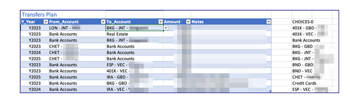

# transfers_plan

This table simulates future transactions which move money between accounts.  

The fields are transaction year, a source (from) account and a target (to) account, an amount and a place for notes.

There is data validation on the account names to ensure they are valid and active. The complete list is generated at build time as a range out to the right. This is necessary because the drop down list function doesn't yet support dynamic arrays.



These data are summarized and carried on the the balances tab in future years on the Add/Wdraw lines by the following Excel formula:

```
=SUM(
  BYROW(
    (tbl_transfers_plan[[From_Account]:[To_Account]]=tbl_balances[@AcctName])*
    HSTACK(-tbl_transfers_plan[Amount],tbl_transfers_plan[Amount]),
    LAMBDA(row,SUM(row))
    )
  *(tbl_transfers_plan[Y_Year]=INDEX([#Headers],COLUMN())))
```

The SUM phrase calculates the net change defined in the transfers_plan for this account, this year