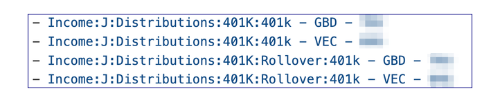
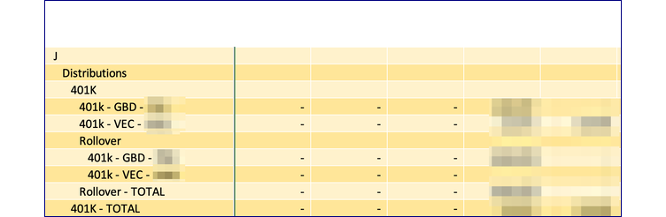
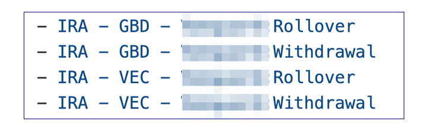

# Use-case procedures

## Add or rename an account

Once the accounts are the way you want in Moneydance, recreate the workbook.

If this is done during the year (typical) then export the account balances report as of the latest date and store it under the name of the first forecast year. Modify the data/path key in `setup.yaml` for the accounts table to point to this file.

## Rename an account

It turns out to be useful to have an account naming convention.  The convention is 
	*type - owner - firm*
where type is 401K, 529, BKG, ESP, HSA, IRA, IRA Roth, MUT, BND<br/>and owner is JNT or the owner's initials.

Notes 

- BND is for - gov't bonds where TRY is for treasury - direct


## How to model a rollover from a 401K to an IRA

### Structure

1. To prevent this from being taxed:
    1. Ensure additional rows are created on the `iande` table, in the distributions area using the `hier_insert_paths` key. In the following example the second set of rows are created under `Rollover`.

    1. Populate these rows with a forecast formula such as:
      ```yaml
      =-SUM(FILTER(INDIRECT("tbl_retir_vals["&this_col_name()&"]"),(tbl_retir_vals[Item]=TRIM([@Account]))*(tbl_retir_vals[Election]="ROLLOVER"),0))
      ```
    3. This will produce a total line on the `iande` table that nets out the rollover.  Assuming taxes references that, the result is that the rollover won't be taxed.


1. Use the folding feature of the aux table to compute the net changes to the target IRA account by creating two lines for the IRA - one for rollover and one for withdrawals.     
    1. User the hier_insert_paths key to insert something like `IRA:Rollover` and `IRA:Withdrawal`, so that `aux` ends up with rows like this:
    
    1. Set the formulas for withdraws to pull from retirement
    ```
    =-XLOOKUP(INDEX(TEXTSPLIT([@Key],":"),1),tbl_retir_vals[Item],INDIRECT("tbl_retir_vals["&this_col_name()&"]"))
    ```
    1. Set the formula for rollovers to pull from the `transfers_plan` (assume only positive rollovers):
    ```
    =SUM(FILTER(tbl_transfers_plan[Amount],(tbl_transfers_plan[To_Account]=INDEX(TEXTSPLIT([@Key],":"),1))*(tbl_transfers_plan[Y_Year]=this_col_name()),0))
    ```

1. Configure the IRA accounts on balances to pull the `Add/Wdraw` line from `aux`.

    ```
    =XLOOKUP(TRIM([@AcctName])&" - TOTAL",tbl_aux[Key],INDIRECT("tbl_aux["&this_col_name()&"]"))
    ```

### Data

1. On the retirement table:
    1. set ROLLOVER as the code
    1. set `Start Date` as January 1st of the rollover year
    1. set `Anny Rate` as zero. If its in mid-year you can fuss with the rate to get the desired amount. If you use the last day of the year, it should be the same as the market gain rate on the balances table.
    1. note the exact amount to be rolled over 
1. On the balances table set the mkt gn rate as zero.
1. Enter the amount rolled over into the `transfers_plan` table as a transfer from bank accounts to the target account.
    1. Realized int/gains and fees, if any, on this account, need to be addressed, for example, by zeroing out the year's value for the expense ratios for that account. 

1. Extract the retirement values and the transfers plan data 

    ```bash
    (.venv) george@GeorgesacStudio budget % dance/extract_table.py -t tbl_retir_vals -w data/test_wb.xlsm
    2023-07-19 20:02:21,229 - extract_table - INFO - Source workbook is data/test_wb.xlsm
    2023-07-19 20:02:21,560 - extract_table - INFO - Wrote to data/retire_template.tsv
    (.venv) george@GeorgesacStudio budget % dance/extract_table.py -t tbl_transfers_plan -w data/test_wb.xlsm
    2023-07-19 20:02:34,639 - extract_table - INFO - Source workbook is data/test_wb.xlsm
    2023-07-19 20:02:34,961 - extract_table - INFO - Wrote to data/transfers_plan.json
    ```

1. Rerun the build

## I-bonds

U.S. Treasury offers a product called i-bond, which allows for the deferral of taxes on the interest, until the bond is cashed out. In order to account for this:

### Structure

1. Create a new category in Moneydance `Income:I:Invest income:Int:Defered Tax`
1. Modify the taxes table to create a row for `Released deferred interest` and a row on the state taxes to subtract it `Interest on US gov obl`. Make sure indented properly.
    1. To avoid an extra build, put in the key value for these lines in column A.
1. Run the `extract_table.py` utility to capture the new lines for the taxes table in a revised template.
1. To get the actual values/lines to show up on the `iande` table and in the 'rlzd int/gn' row on the balances table, and the invest_iande work tables:
    1. Recreate `iande.tsv` `invest_actl.tsv`, and `invest_iande.tsv` files.
    1. Run build.

### Data

1. On the invest_iande_work tab, filter both the tables to select the category `Int:Defered-tax`.  Modify the ratios with the expected rate for the duration. Compute the total interest over the duration. That will be needed for taxes.
1. Put the total interest computed above in the right year on the two new tax rows(positive & negative)
1. Put the interest and principal in a line in the `transfers_planned` table.
1. Save the file.
1. Run the `preserve_changed.py` utility - to preserve the input ratios and taxable interest.
1. Run build.
1. This should now have correct balances for all years, including zero when cashed out, as well as taxable impact on the distribution year.


## New year - new tax rates

Pull the IRS data as a .csv file. Use `bracket_fix.py` to transform into the correct format.

For example:

```zsh
dance/bracket_fix.py data/2022_tax_brackets_irs.csv 
0,0.10,0
20549.0,0.12,410.8800000000001
83550.0,0.22,8766.0
178150.0,0.24,12329.0
340100.0,0.32,39537.0
431900.0,0.35,52494.0
647850.0,0.37,65451.0
Copy the above numbers into the table and add the year
```
