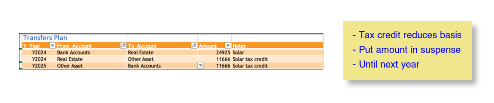

# Use-case procedures

## Add or rename an account

Once the accounts are the way you want in Moneydance, recreate the workbook.

If this is done during the year (typical) then 

1. export the account balances report as of the latest date and store it under the name of the first forecast year. 
1. Modify the data/path key in `config.yaml` for the accounts table to point to this file.
1. If needed add it to the list of accounts under `include_zeros`.
1. Rebuild the file with `dance/util/build`

## Rename an account

It turns out to be useful to have an account naming convention.  The convention is 
	*type - owner - firm*
where type is 401K, 529, BKG, ESP, HSA, IRA, IRA Roth, MUT, BND<br/>and owner is JNT or the owner's initials.

Notes 

- BND is for - gov't bonds where TRY is for treasury - direct


## How to model a rollover from a 401K to an IRA

### Structure

1. To prevent this from being taxed:
    1. Ensure additional rows are created on the `iande` table, in the distributions area using the `hier_insert_paths` key. In the following example the second set of rows are created under `Rollover`.

    1. Populate these rows with a forecast formula such as:
      ```yaml
      =-SUM(FILTER(INDIRECT("tbl_retir_vals["&this_col_name()&"]"),(tbl_retir_vals[Item]=TRIM([@Account]))*(tbl_retir_vals[Election]="ROLLOVER"),0))
      ```
    3. This will produce a total line on the `iande` table that nets out the rollover.  Assuming taxes references that, the result is that the rollover won't be taxed.


1. Use the folding feature of the aux table to compute the net changes to the target IRA account by creating two lines for the IRA - one for rollover and one for withdrawals.     
    1. User the hier_insert_paths key to insert something like `IRA:Rollover` and `IRA:Withdrawal`, so that `aux` ends up with rows like this:
    
    1. Set the formulas for withdraws to pull from retirement
    ```
    =-XLOOKUP(INDEX(TEXTSPLIT([@Key],":"),1),tbl_retir_vals[Item],INDIRECT("tbl_retir_vals["&this_col_name()&"]"))
    ```
    1. Set the formula for rollovers to pull from the `transfers_plan` (assume only positive rollovers):
    ```
    =SUM(FILTER(tbl_transfers_plan[Amount],(tbl_transfers_plan[To_Account]=INDEX(TEXTSPLIT([@Key],":"),1))*(tbl_transfers_plan[Y_Year]=this_col_name()),0))
    ```

1. Configure the IRA accounts on balances to pull the `Add/Wdraw` line from `aux`.

    ```
    =XLOOKUP(TRIM([@AcctName])&" - TOTAL",tbl_aux[Key],INDIRECT("tbl_aux["&this_col_name()&"]"))
    ```

### Data

1. On the retirement table:
    1. set ROLLOVER as the code
    1. set `Start Date` as January 1st of the rollover year
    1. set `Anny Rate` as zero. If its in mid-year you can fuss with the rate to get the desired amount. If you use the last day of the year, it should be the same as the market gain rate on the balances table.
    1. note the exact amount to be rolled over 
1. On the balances table set the mkt gn rate as zero.
1. Enter the amount rolled over into the `transfers_plan` table as a transfer from bank accounts to the target account.
    1. Realized int/gains and fees, if any, on this account, need to be addressed, for example, by zeroing out the year's value for the expense ratios for that account. 

1. Extract the retirement values and the transfers plan data 

    ```bash
    (.venv) george@GeorgesacStudio budget % dance/extract_table.py -t tbl_retir_vals 
    2023-07-19 20:02:21,229 - extract_table - INFO - Source workbook is data/test_wb.xlsx
    2023-07-19 20:02:21,560 - extract_table - INFO - Wrote to data/retire_template.tsv
    (.venv) george@GeorgesacStudio budget % dance/extract_table.py -t tbl_transfers_plan -w data/test_wb.xlsx
    2023-07-19 20:02:34,639 - extract_table - INFO - Source workbook is data/test_wb.xlsx
    2023-07-19 20:02:34,961 - extract_table - INFO - Wrote to data/transfers_plan.json
    ```

1. Rerun the build

## Add an Inherited IRA

1. Moneydance
    1. The account should be created in Moneydance and exported according to [adding account](#add-or-rename-an-account)
1. In accounts
    1. Put the account name in the `force_active` key. (Since it will have a zero balance, it would default to inactive if this is not set)
    1. Under `dyno_fields` add to list to show distribution plan exists
1. For retirement
    1. Add the IRA name and distribution plan to `retir_template.tsv`.
    1. The retire tab is not preserved, (should it be?) so in config.yaml set first_item parm to set the 1st year withdrawal.
1. In aux
    1. Inherit and Withdrawal rows should be added to the `hier_insert_paths` key
    1. Add the account to the `matches` key of the `fcst_formulas` section for the IRA withdrawal sections
    1. After running `build`, input the value of the IRA in the aux table under account:inherit.  Preserve this with `preserve_changed.py -s`.
1. For iande:
    1. Add entries in hier_insert_paths for the J: and Y: items 
    1. Add account name to the fcst_formula retir_vals for the new account.
1. For invest_iande_work:
    1. Provide for any account fees, for example:

        ```
        - base_field: Key # forecast fees for new items with no history
            matches:
            - IRA - GBD - FID:Investing:Account Fees 
            formula: =AVERAGE(tbl_invest_iande_ratios[@5<Y1234])
            first_item: -0.0075,-0.0075,-0.0075,-0.0075,-0.0075
        ```    


## I-bonds

U.S. Treasury offers a product called i-bond, which allows for the deferral of taxes on the interest, until the bond is cashed out. In order to account for this:

### Structure

1. Create a new category in Moneydance `Income:I:Invest income:Int:Defered Tax`
1. Modify the taxes table to create a row for `Released deferred interest` and a row on the state taxes to subtract it `Interest on US gov obl`. Make sure indented properly.
    1. To avoid an extra build, put in the key value for these lines in column A.
1. Run the `extract_table.py` utility to capture the new lines for the taxes table in a revised template.
1. To get the actual values/lines to show up on the `iande` table and in the 'rlzd int/gn' row on the balances table, and the invest_iande work tables:
    1. Recreate `iande.tsv` `invest_actl.tsv`, and `invest_iande.tsv` files.
    1. Run build.

### Data

1. On the invest_iande_work tab, filter both the tables to select the category `Int:Defered-tax`.  Modify the ratios with the expected rate for the duration. Compute the total interest over the duration. That will be needed for taxes.
1. Put the total interest computed above in the right year on the two new tax rows(positive & negative)
1. Put the interest and principal in a line in the `transfers_planned` table.
1. Save the file.
1. Run the `preserve_changed.py` utility - to preserve the input ratios and taxable interest.
1. Run build.
1. This should now have correct balances for all years, including zero when cashed out, as well as taxable impact on the distribution year.


## New year - new tax rates
We use the subtraction method.
The `Range` column should contain the top of the bracket.

The best source of the subtraction method seems to be in the 1040 instructions.
The easiest thing is to type the data in. 

The following search will turn up instructions toward the end of the year.
It may be marked as draft.

`2025 1040 instructions`

You should be able to find something like:

`https://www.irs.gov/pub/irs-dft/i1040gi--dft.pdf`

Within that pdf search for `Tax Computation Worksheet`

After modifying the table, remember to [extract](./operations.md#extract-table) it.

### Method to covert to subtraction format

The following was attempted but getting the data in a consistent format has proven more difficult than typing it in.
This method should be considered deprecated.

Pull the IRS data as a .csv file. Use `bracket_fix.py` to transform into the correct format. 
If the file name does not start with the year as below, use the -y option.
   
   ```zsh
       dance/util/bracket_fix.py data/tax_rates/2023_tax_brackets_irs.csv 
       Year    Range  Rate  Subtract
       2023      0.0  0.10       0.0
       2023  22000.0  0.12     440.0
       2023  89450.0  0.22    9385.0
       2023 190750.0  0.24   13200.0
       2023 364200.0  0.32   42336.0
       2023 462500.0  0.35   56211.0
       2023 693750.0  0.37   70086.0
       The above numbers copied into paste buffer.
       Paste into the table
   ```

## Add a row to taxes

In this example, installation of solar panels requires a new tax credit for a future year.  Eventually it will become actual, but starts as forecast.

The accounting plan is as follows. The purchase is broken into two parts - the amount that modifies the basis of the real estate, and the amount that is the tax credit.  For the year of purchase we put the tax credit into the `Other Assets` account, then we take it back out in the year when the taxes are filed, the next year.

Modify the tax template. 

- Unhide the leading fields. 
- Insert a row using Excel (line 177 here). 
- The `key` field will be recreated from the template during the build, but if you like you can create it as the fully qualified value of the `line` field. You will need this for the forecast formula match clause. 
- The tax doc reference is optional, but helps keep you sane. 
- The `Source`, `Tab` and `Sign` fields are used to populate the actuals. Here we choose to use a new row with the same name in the manual_actl table.


Put the reference into the `manual_actl` table:


Now create the data in the transfers plan.    We use the notes field as a tag to support getting the values for the tax line we created above.



Save the file and extract the tables with each of the following commands:
```zsh
dance/extract_table.py -t tbl_taxes
dance/extract_table.py -t tbl_transfers_plan
dance/extract_table.py -t tbl_manual_actl
```

Now put modify the forecast section taxes in `config.yaml`. The formula to capture the amount in the new line in on the `taxes` table sums up values from the `transfer_plan` based on the "to" account, the "tag", and the year.

``` yaml
    - base_field: Key # Solar tax credit
        matches:
        - Fed total tax:Tax credits:Residential Clean Energy Credit
        formula: =SUM(FILTER(tbl_transfers_plan[Amount],(tbl_transfers_plan[To_Account]="Other Asset")*(tbl_transfers_plan[Notes]="Solar tax credit")*(tbl_transfers_plan[Y_Year]="Y1234"),0))
```

Finally, run the `build` and verify its working as desired.
