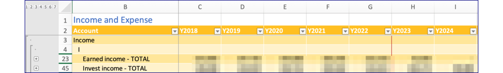

# Design of the workbook

1. Heavy use of Tables with named columns
    - Many which include an annual time series going from past into future
    - Tables are housed on various worksheets which are grouped and color coded.
1. Bias toward use of modern array oriented Excel functions
    - As tables don't support dynamic arrays - generally each function is reduced to a single value
    - Progress is underway to remove VBA functions that rely on retrieving data, but some calculations are expected to remain.
    - Excel Lambda functions are in use to make calculations more readable.
1. Formulas work best with hard-coded column names, avoiding volitile functions and over large dependencies
    - These are provided at build time
    - This impairs ease of revising formulas in rows
1. Use of "folding" technique to make navigation easier and calculations less obtuse
    - Replaces the SUBTOTAL(9,...) technique with aggregation by SUM, PROD, MIN, MAX special tax calculations
    - Unlike SUBTOTAL(9,...) uses the inner level aggregations not the interior leaf values.  
    - This supports typical tax calcs.

By convention in the documentation we call the workbook `fcast.xlsm`, although it could be anything.

## Dependencies

There are some complex dependencies between the tables.  Generally, the flow is between rows in a year, then certain values are carried forward into the next year.

## Tables

Many of the tables represent a set of annual time series.  The data elements are typically financial values associated with a year.  For instance, the balances table tracks how balances change year by year.

Other columns are labeled with appropriate short column labels.

An index of tables is maintained on the 'utility' worksheet, which allows the worksheet to be located by the VBA function.  This itself is a table and it is created by a Python program `index-tables.py`.

## Worksheets

Tables are distributed over a set of worksheets. Sometimes a worksheet holds more than one table.

For more information: [worksheets](./worksheets.md)

## Excel Calculations

The advent of array functions in Office 365 allows for fairly succinct and readable formulas, which do not suffer from the problem of dependency updates.  Generally, by referencing only the needed columns true dependency loops can be avoided.  

Getting this right turned out to be a bit tricky.  Some techniques are discussed in [Idioms](./idioms.md).  The winning technique is to isolate the columns used at build time, so that entire tables are not needed to be referenced.

By the way, the original plan was to use Visual Basic (functions and macros) allows for calculations to be done in a more readable manner.  But there was a downside in that Excel cannot use its dependency trees to know what needs to occur when the macros reference or update a value with this method.  

## Idioms

A glossary of Excel array idioms is available. [Idioms](./idioms.md)

## Functions

There are Visual Basic for Applications functions in this worksheet.  These are listed in the [VBA index](./vba_index.md).  The [full source](./vba_sorted.md) is also imported here as part of the build process.  With the approach indicated in [Excel Calculations](#calculations) these are being removed where not used.  Some may still be useful, but the reference to other cells should be replaced.

## Conventions

### Excel conventions

- All table names begin with `tbl_`.
- Except where visible, such as column names and row labels, use lowercase except for acronyms.
- Use underscores between words.
- Use standard abbreviations as follows:

    |	long	|	short	|
    |---|---|
    |	actual	|	actl	|
    |	annuity	|	anny	|
    |	balances	|	bals	|
    |	duration	|	dur	|
    |	investments	|	invest	|
    |	parameters	|	parms	|
    |	pension	|	pens	|
    |	retirement	|	retir	|
    |	value or valuation 	|	val	|

### Naming conventions for accounts

- Actual account names are generally of the form *type-who-firm* where type is one of 401K, 529, BKG, BND, ESP, HSA, IRA, IRA Roth, LON, MUT.
