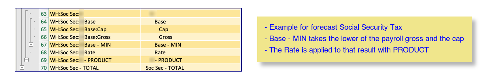

# Design of the workbook

## Highlights

1. Annual time series going from past actual into future forecast
1. Uses Excel Tables and structured references for readability and usability
1. Build of the workbook is defined for initialization and periodic updates
    - Controlled by a definition file, including formulas
    - Preservation of input data is supported so re-building can be done
1. Avoids volatile functions and over large dependencies by using [build time](#build-time-column-substitutions) substitutions for generics such as "this column"[^1].
1. Bias toward use of modern array oriented Excel functions
    - Excel Lambda functions[^2] are in use to make calculations more readable.
    - Tables don't support dynamic arrays - array functions reduced to a single value
1. Use of "folding" technique to make navigation easier and calculations less obtuse
    - Replaces the SUBTOTAL(9,...) technique with aggregation by SUM, PROD, MIN, MAX & special tax calculations
    - Unlike SUBTOTAL(9,...) uses the inner level aggregations not the interior leaf values.  
    - This supports typical tax calcs.

## Dependencies

There are some complex dependencies between the tables.  Generally, the flow is between rows in a year, then certain values are carried forward into the next year.

## Tables

Tables are housed on various worksheets which are grouped and color coded.

Many of the tables represent a set of annual time series.  The data elements are typically financial values associated with a year.  For instance, the balances table tracks how balances change year by year.
The view below selects just the end balance row.


Other columns are labeled with appropriate short column labels.

An index of tables is maintained on the 'utility' worksheet, which allows the worksheet to be located by the VBA function.  This itself is a table and it is created by a Python program `index-tables.py`.

## Worksheets

Tables are distributed over a set of worksheets. Sometimes a worksheet holds more than one table.


For more information: [worksheets](./worksheets.md)

## Excel Calculations

Array functions in Office 365 allow for fairly readable formulas, which do not suffer from the problem of dependency updates.  Generally, by referencing only the needed columns true dependency loops can be avoided.  

Getting this right turned out to be a bit tricky.  Some techniques are discussed in [Idioms](./idioms.md).  The winning technique is to isolate the columns used at build time, so that entire tables are not needed to be referenced.

The original plan was to use Visual Basic (functions and macros) allowing for readable calculations. But there was a downside in that Excel cannot use its dependency trees to know what needs to occur when the macros reference or update a value with this method.  

## Build-time column substitutions

The winning technique is to isolate the columns used at build time, so that entire tables are not needed to be referenced. 

Both the indirect and indexing methods have serious drawbacks, so the substitution method was created. This allows the formula to be written with a generic year, which will be substituted at build time.

```title="formula as written in setup.yaml"
formula: =XLOOKUP([@Key],tbl_invest_actl[Key],tbl_invest_actl[Y1234])
```

```title="formula as it occurs in Excel"
=XLOOKUP([@Key],tbl_invest_actl[Key],tbl_invest_actl[Y2022])
```

There are three types of substituion[^3]:  

1. Indicates a single year with the form `Ynnnn`.
2. Indicates an offset, picking out a prior column. The form is `Ynnnn-m`, which will use the year `m` years before nnnn. 
3. Indicates a range of columns.  The form is `m<Ynnnn`. This produces a range of columns for the `m` years prior.

This method is much faster and does not create unwarranted dependencies. It is also much easier to read these formulas. Its drawback is that each column in the time series has a different formula[^1].

## Folding

By folding we mean using the row grouping feature of Excel, where the final row of a group contains the aggregation of the items folded under it. 


The aggregation is performed on the last line of the group as indicated by the word occuring after the final hyphen.
The aggregation methods TOTAL, MIN, MAX, PRODUCT, FED_TAX, CT_TAX.

The technique is similar to that provided by Excel's SUBTOTAL function but differs as follows:

Excel ignores nested aggregations - instead it re-sums the values from the leaf nodes.
This is fine for subtotals but does not work when mixing aggregation types across levels.
In all cases the system takes the values that are directly below this aggregation level, no matter if they are leaf nodes or aggregates themselves.

Unlike the subtotal method this grabs the subordinate aggregation lines not the underlying leaf nodes
This methods allows the folding to do things like sum the results of subordinate aggregations that are not themselves sums.

For example, consider the calculation of social security withholding. Row 67 is the min of rows 65 and 66 and is itself combined  with 68 as a product into 69. The product calculation does not involve the lower level values on 65, and 66.

 

## Idioms

A glossary of Excel array idioms is available. [Idioms](./idioms.md)

## Functions

### LAMBDA functions

The modern lambda functions seem to be preferable to VBA. Eventually this should allow the removal of much of the original VBA.

The functions are stored as defined names in Excel.  They are defined in the `lambdas:` section of the `setup.yaml` file[^4].

The following list is sourced from that file by `util.doc_lambdas.py`.

[List of LAMBDA functions](./functions/excel_lambdas.md)

#### Notes about using LAMBDAs in defined names

1. Parameters of `LAMBDA` and `LET` need to be prefixed with _xlpm. Each of the parameters needs a hidden defined name too.  Excel creates these upon open. It appears that Excel converts input "lambda" into "LAMBDA", then subsequent processing is based on the upper case version. So when Openpyxl provides these functions, they need to be provided in uppercase or the hidden defined names never get created.

1. Do not use table names in the formulas as that creates a hidden defined name with that value, causing the real table to get "_1" appended to its name.

## Conventions

### Excel conventions

- All table names begin with `tbl_`.
- Except where visible, such as column names and row labels, use lowercase except for acronyms.
- Use underscores between words.
- Use standard abbreviations as follows:

    |	long	|	short	|
    |---|---|
    |	actual	|	actl	|
    |	annuity	|	anny	|
    |	balances	|	bals	|
    |	duration	|	dur	|
    |	investments	|	invest	|
    |	parameters	|	parms	|
    |	pension	|	pens	|
    |	retirement	|	retir	|
    |	value or valuation 	|	val	|

### Naming conventions for accounts

- Actual account names are generally of the form *type-who-firm* where type is one of 401K, 529, BKG, BND, ESP, HSA, IRA, IRA Roth, LON, MUT.

[^1]: This does impair ease of revising formulas in rows, but produces performant spreadsheet
[^2]: Progress is underway to remove VBA functions that rely on retrieving data, but some VBA calculations are expected to remain.
[^3]: Substitutions are implemented as regular expression rules in `xl_formulas.py` 
[^4]: Note that a few steps are needed to get formulas using `LAMBDA` and `LET` into good order.  The logic can be found in `util.xl_formulas.prepare_formula`.